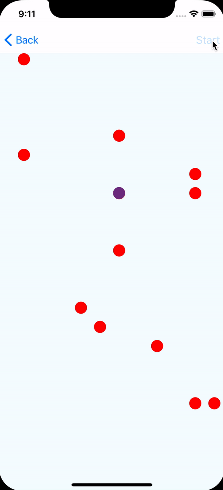

# react-native-spline-interpolate

&nbsp;&nbsp;&nbsp;&nbsp;

Small library for performing interpolation imitating physical movement. With this library it's possible generate animated node which could interpolate given points' mapping with input node (e.g. attached to `timing` animation) in a very smooth way using cubic splines.

## What is cubic spline?

In order to make interpolation really smooth it's required to build a smooth interpolation function (e.g. differentiable up to infinity — for all derivatives). It could be achieved using Lagrange's interpolation, but it gives some unwanted effects. Runge's phenomenon could be observable and a complexity is quite high then.

Splines appears to be quite a good solution for our case. We could assume that function doesn't have to be only one polynomial, but could be defined with different polynomials on given ranges defined by interpolation nodes. In order to make it smooth we could make it continuous when it comes not only to values but to derivatives' values and derivatives' of derivatives as well.

Splines' formulas have been very nice explained here: https://en.wikiversity.org/wiki/Cubic_Spline_Interpolation. As a result of given steps, we obtain matrix of equations which we should solve in order to determine factors of interpolation polynomials.
We could solve this equation once (in JavaScript) and then build nodes' structure for performing interpolation. The basic approach for solving matrices is Gauss-Jordan's method which has cubic computation complexity and quadratic memory complexity. However, considering that this matrix is dense and regular, I managed to achieve the result in a linear complexity whenit comes to computation and memory usage as well.

Implementation could be seen in `./index.js` file.

## And how it comes to React Native?

I have made two implementation of this feature. One has been written with RN's `Animated` API, but it's very hacky and is not very performant (evaluation of each frame has great complexity since handling logical expression has been done with the linear interpolation taken from RN's core) so I recommend to use the second implementation done with `react-native-reanimated`. Using logical (`cond`) nodes I manage to do it without any dirty workaround.

## Getting started

### Installation of `react-native-reanimated` version
```bash
yarn add react-native-reanimated-spline-interpolate
```

### Installation of RN's legacy version
```bash
yarn add react-native-animated-spline-interpolate
```

## Usage
### core RN's `Animated`
```javascript
import React, { Component } from "react";
import { View, Animated } from "react-native";
import { splineInterpolate } from "../../src/animatedSplineInterpolation";

const { multiply, Value, timing } = Animated;

const inputRange = [0, 20, 45, 70, 85, 100];
const outputRange = [100, 70, 60, 30, 35, 0];

export default class Example extends Component {
  _transX = new Value(0);
  _anim = timing(this._transX, {
    toValue: 100,
    duration: 5000,
    useNativeDriver: true
  }).start();
  render() {
    const interpolated = splineInterpolate(this._transX, { inputRange, outputRange });
    return (
      <View>
        <Animated.View
          style={{ transform: [{ translateX: interpolated }] }}
        />
      </View>
    );
  }
}

```

### `Reanimated`
```javascript
import React, { Component } from "react";
import { View } from "react-native";
import { splineInterpolate } from "../../src/reanimatedSplineInterpolation";
import Animated, { Easing } from "react-native-reanimated";

const { cond, multiply, startClock, stopClock, clockRunning, block, timing, Value, Clock } = Animated;

function runTiming() {
  const state = {
    finished: new Value(0),
    position: new Value(0),
    time: new Value(0),
    frameTime: new Value(0)
  };
  const clock = new Clock();
  const config = {
    duration: 5000,
    toValue: new Value(100),
    easing: Easing.linear
  };

  return block([
    cond(clockRunning(clock), 0, [startClock(clock)]),
    timing(clock, state, config),
    cond(state.finished, stopClock(clock)),
    state.position
  ]);
}

const inputRange = [0, 20, 70, 100];
const outputRange = [0, 40, 50, 100];
class Example extends Component {
  _transX = runTiming();
  render() {
    const interpolated = splineInterpolate(this._transX, { inputRange, outputRange });
    return (
      <View>
          <Animated.View
            style={{ transform: [{ translateX: interpolated }] }}
          />
      </View>
    );
  }
}
```


